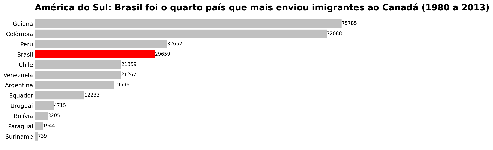
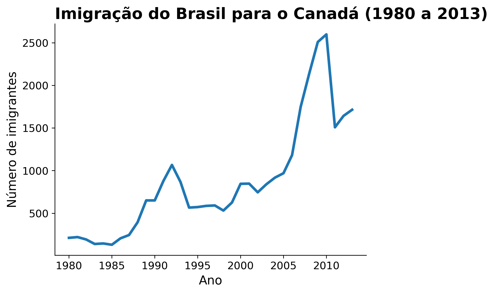

# Análise de Imigrantes Brasileiros no Canadá

Este projeto tem como objetivo analisar o perfil e a evolução dos imigrantes brasileiros no Canadá, utilizando dados históricos e técnicas de análise exploratória em Python.

## Análise Realizada

A análise foi conduzida no Jupyter Notebook [`analise_de_imigrantes_brasileiros.ipynb`](analise_de_imigrantes_brasileiros.ipynb). Foram exploradas tendências de imigração ao longo dos anos, distribuição por países da América do Sul, além de visualizações para identificar padrões relevantes sobre a imigração brasileira.

## Base de Dados

A base de dados utilizada, [`imigrantes_canada.csv`](imigrantes_canada.csv), contém informações sobre o número de imigrantes de diversos países para o Canadá, segmentados por ano. Os principais campos incluem país de origem, ano e quantidade de imigrantes.

## Bibliotecas Utilizadas

As principais bibliotecas utilizadas, listadas em [`requirements.txt`](requirements.txt), são:

1. **[pandas](https://pandas.pydata.org/)** - Manipulação e análise de dados.
2. **[numpy](https://numpy.org/)** - Operações numéricas e vetoriais.
3. **[matplotlib](https://matplotlib.org/)** - Visualização de dados.
4. **[seaborn](https://seaborn.pydata.org/)** - Visualização estatística de dados.
5. **[jupyter](https://jupyter.org/)** - Ambiente interativo para notebooks.

## Visualizações e Insights

As análises resultaram em duas visualizações principais que destacam diferentes aspectos da imigração para o Canadá.

### Comparativo na América do Sul

Este gráfico de barras horizontais compara o número total de imigrantes de cada país sul-americano para o Canadá durante o período de 1980 a 2013. A visualização destaca a posição do Brasil em relação aos seus vizinhos, mostrando que, apesar de não ser o líder, figura entre os principais países emissores de imigrantes da região.

### Evolução da Imigração Brasileira ao Longo do Tempo

O gráfico de linha acima ilustra a tendência temporal da imigração de brasileiros para o Canadá. A análise revela os seguintes pontos-chave:

* **Tendência Geral de Crescimento:** Observa-se um claro aumento no fluxo migratório ao longo das três décadas, indicando um interesse crescente pelo Canadá como destino.
* **Picos de Imigração:** O gráfico destaca um crescimento acentuado a partir de meados dos anos 2000, culminando em um pico expressivo por volta de 2010.
* **Períodos de Flutuação:** Existem períodos de maior estabilidade e picos menores, como o observado no início da década de 1990, sugerindo que o fluxo pode ser influenciado por fatores econômicos e políticos tanto no Brasil quanto no Canadá.